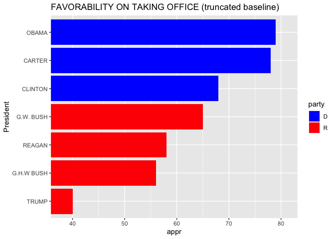
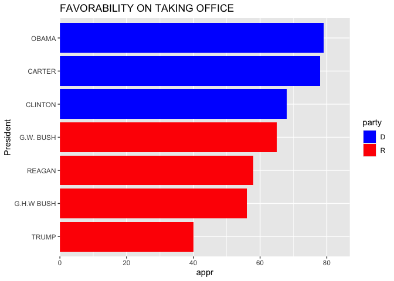
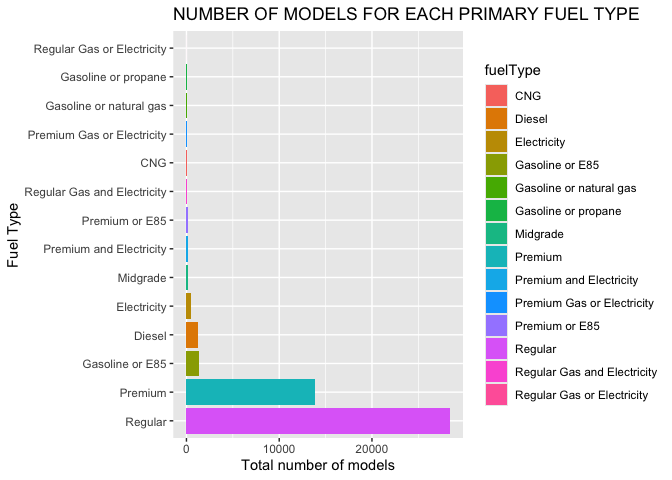
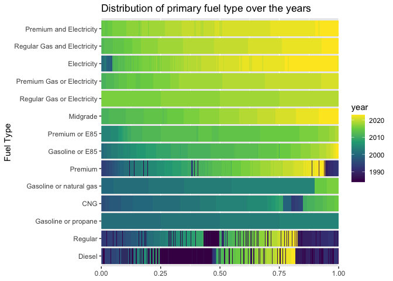
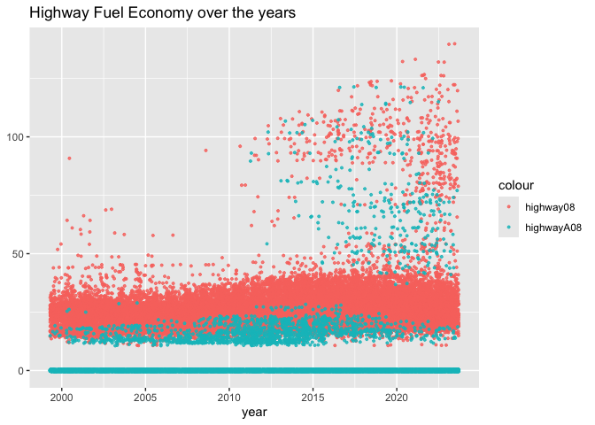
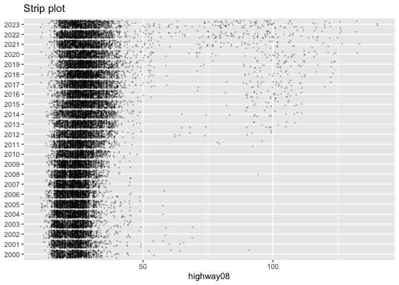
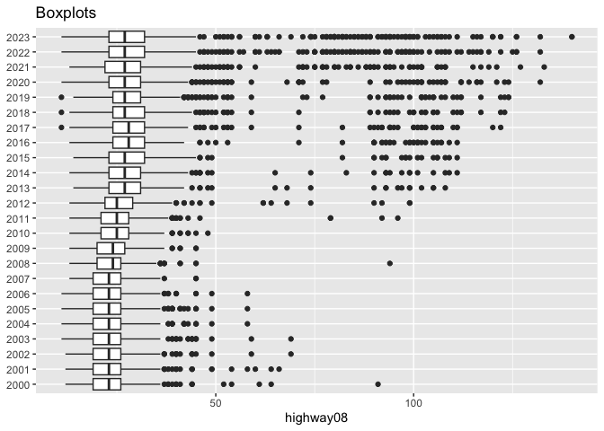
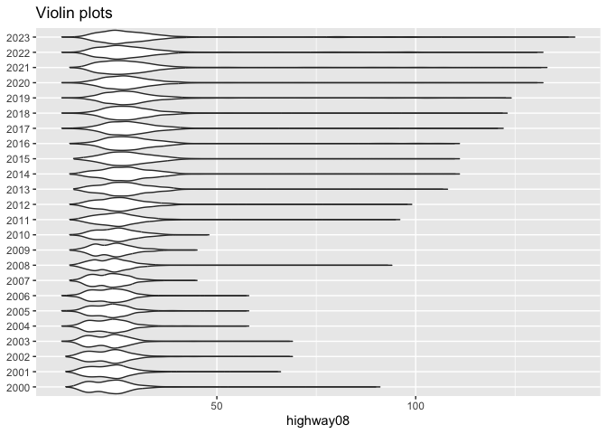
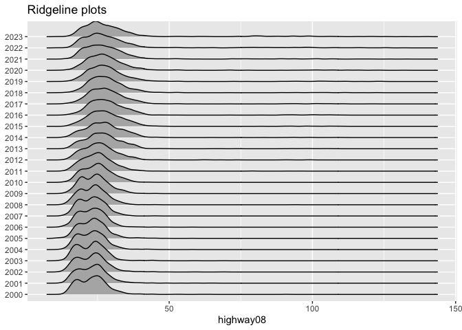

**Jocelyne Horanituze**

Sep 10, 2026

This section starts with a bar chart baseline comparison (truncated
vs. zero baseline), then applies the same lens to EPA fuel economy data,
comparing fuel type distributions over time and four different chart
types (strip plot, boxplot, violin plot, ridgeline plot) for the same
highway MPG data.

## 1. Bar Chart Baselines: Why Zero Matters

A bar chart’s length only represents a fair proportion of the underlying
values when its axis starts at zero. To demonstrate this, the same
presidential approval-on-taking-office data is plotted twice below:
first with a truncated (non-zero) baseline, then with a proper zero
baseline.

**Misleading version (truncated baseline)**

<!-- -->

- The bar lengths don’t reflect the actual data ratio — for instance,
  the difference between Trump and Obama is 39 points, but truncating
  the x-axis makes that difference look much smaller than it is.
- Without a zero baseline shown, the chart is misleading to anyone
  comparing bar lengths at a glance.

**Corrected version (zero baseline)**

<!-- -->

- This version is a better representation of the data because:
  - It has a baseline of 0, which makes the interpretation less biased
    compared to the truncated version above.
  - The actual difference between Trump’s and Obama’s approval bar
    length is now obvious and significant, matching the real 39-point
    gap — in the truncated version, the difference was significant in
    numbers but the bar length told a different story.
  - The bar lengths reflect the actual data ratio.

## 2. EPA Fuel Economy: Distribution by Fuel Type

Variables used from the EPA fuel economy dataset:

- hwy: highway08 (highway MPG for fuelType1, single fuel vehicles) and
  highwayA08 (highway MPG for fuelType2, dual fuel vehicles)
- cyl: cylinders
- displ: displ
- primary fuel type: fuelType

<table class="table" style="width: auto !important; margin-left: auto; margin-right: auto;">

<caption>

The number of models for each primary fuel type
</caption>

<thead>

<tr>

<th style="text-align:left;">

Fuel Type
</th>

<th style="text-align:right;">

Total number of models
</th>

</tr>

</thead>

<tbody>

<tr>

<td style="text-align:left;">

CNG
</td>

<td style="text-align:right;">

60
</td>

</tr>

<tr>

<td style="text-align:left;">

Diesel
</td>

<td style="text-align:right;">

1254
</td>

</tr>

<tr>

<td style="text-align:left;">

Electricity
</td>

<td style="text-align:right;">

484
</td>

</tr>

<tr>

<td style="text-align:left;">

Gasoline or E85
</td>

<td style="text-align:right;">

1387
</td>

</tr>

<tr>

<td style="text-align:left;">

Gasoline or natural gas
</td>

<td style="text-align:right;">

20
</td>

</tr>

<tr>

<td style="text-align:left;">

Gasoline or propane
</td>

<td style="text-align:right;">

8
</td>

</tr>

<tr>

<td style="text-align:left;">

Midgrade
</td>

<td style="text-align:right;">

155
</td>

</tr>

<tr>

<td style="text-align:left;">

Premium
</td>

<td style="text-align:right;">

13811
</td>

</tr>

<tr>

<td style="text-align:left;">

Premium Gas or Electricity
</td>

<td style="text-align:right;">

55
</td>

</tr>

<tr>

<td style="text-align:left;">

Premium and Electricity
</td>

<td style="text-align:right;">

153
</td>

</tr>

<tr>

<td style="text-align:left;">

Premium or E85
</td>

<td style="text-align:right;">

127
</td>

</tr>

<tr>

<td style="text-align:left;">

Regular
</td>

<td style="text-align:right;">

28390
</td>

</tr>

<tr>

<td style="text-align:left;">

Regular Gas and Electricity
</td>

<td style="text-align:right;">

84
</td>

</tr>

<tr>

<td style="text-align:left;">

Regular Gas or Electricity
</td>

<td style="text-align:right;">

4
</td>

</tr>

</tbody>

</table>

<!-- -->

- Some fuel types (Regular gas or electricity, Gasoline or natural gas,
  Gasoline or propane) have fewer than 10 models, making them hard to
  see next to fuel types like Premium (13,811 models) and Regular
  (28,390 models). Due to this large range in variability, it’s hard to
  tell the exact number of models for the smaller fuel-type categories.
- The highest number of models (28,390) use **Regular** as their primary
  fuel type, followed by Premium, which is used by a total of **13,811**
  models.

## 3. EPA Fuel Economy: Fuel Type Over the Years

<!-- -->

- There has been a discontinuation in the use of CNG as a fuel type
  around 2015–2016.
- Premium and electricity fuel types started to be used after 2013.
- The highest number of models that used Regular and Diesel were between
  1984 and 1992.
- Gasoline or propane was used between 2000 and 2010.

## 4. EPA Fuel Economy: Highway MPG Over the Years

**Single/dual fuel comparison**

<!-- -->

- Overall, highway08 (highway MPG for fuel type 1, single fuel vehicles)
  is higher compared to highwayA08 (highway MPG for fuel type 2, dual
  fuel vehicles).
- Overall MPG significantly increased after year 2010.
- MPG was lower between 2005 and 2010.

**Revisited: comparing distribution plot types**

The same highway MPG data by year is shown below using four different
chart types, to compare how well each communicates the trend and shape
of the distribution.

<!-- --><!-- --><!-- --><!-- -->

- With **box plots**, it’s easier to see that over time the outlying
  observations increase, meaning the highway gas mileage is
  significantly increasing over time.
  - Over time, the distributions are becoming more skewed.
  - It’s hard to tell where the observations are most concentrated when
    using box plots.
- With the **violin plot**, it’s easier to see the shape of the
  distribution — as the plot gets larger, so does the number of
  observations.
  - It’s harder to see individual observations.
- With **ridgeline plots**, it’s easier to compare the distribution for
  every year on the same plot.
  - It provides more detail about the skewness of the data compared to
    the box plot and violin plot.
  - It’s easier to see that the distributions differ from each other
    compared to the violin plots.
- With the **strip plot**, each data point is shown individually, unlike
  the plots above.
  - It’s easier to spot the years with outlying data points.
  - The downside is that as the number of data points increases, the
    plot becomes more crowded and harder to interpret.
