Jocelyne Horanituze
Sep 10, 2026

**Jocelyne Horanituze**

Sep 10, 2026

This section works through the nycflights13 dataset end to end: airport
reference data, departure delay summaries, air time distributions,
top/summer-only/high-altitude destinations, cancellation rates mapped by
destination, and how departure delay, arrival delay, wind speed, and
time of day relate to one another.

## 1. Airport Reference

<table class="table" style="width: auto !important; margin-left: auto; margin-right: auto;">

<caption>

New York City Airport Names
</caption>

<thead>

<tr>

<th style="text-align:left;">

Airport Name
</th>

<th style="text-align:left;">

Airport Code
</th>

</tr>

</thead>

<tbody>

<tr>

<td style="text-align:left;">

Newark Liberty Intl
</td>

<td style="text-align:left;">

EWR
</td>

</tr>

<tr>

<td style="text-align:left;">

John F Kennedy Intl
</td>

<td style="text-align:left;">

JFK
</td>

</tr>

<tr>

<td style="text-align:left;">

La Guardia
</td>

<td style="text-align:left;">

LGA
</td>

</tr>

</tbody>

</table>

## 2. Departure Delay Summary

<table class="table" style="width: auto !important; margin-left: auto; margin-right: auto;">

<caption>

Average and Median Departure Delays
</caption>

<thead>

<tr>

<th style="text-align:left;">

Airport Code
</th>

<th style="text-align:right;">

Average dep delay
</th>

<th style="text-align:right;">

Median dep delay
</th>

</tr>

</thead>

<tbody>

<tr>

<td style="text-align:left;">

EWR
</td>

<td style="text-align:right;">

15.10795
</td>

<td style="text-align:right;">

-1
</td>

</tr>

<tr>

<td style="text-align:left;">

JFK
</td>

<td style="text-align:right;">

12.11216
</td>

<td style="text-align:right;">

-1
</td>

</tr>

<tr>

<td style="text-align:left;">

LGA
</td>

<td style="text-align:right;">

10.34688
</td>

<td style="text-align:right;">

-3
</td>

</tr>

</tbody>

</table>

- EWR has the highest average departure delay, followed by JFK and LGA,
  with delays of 15.1 minutes, 12.1 minutes, and 10.3 minutes
  respectively.
- The median delay tells a different story: LGA has the highest median
  delay, followed by JFK and then EWR, with median delays of -3 minutes,
  -1 minute, and -1 minute respectively.
- Even though EWR has the highest average departure delay, it’s more
  likely to delay by fewer minutes compared to LGA and JFK.

## 3. Air Time Distributions

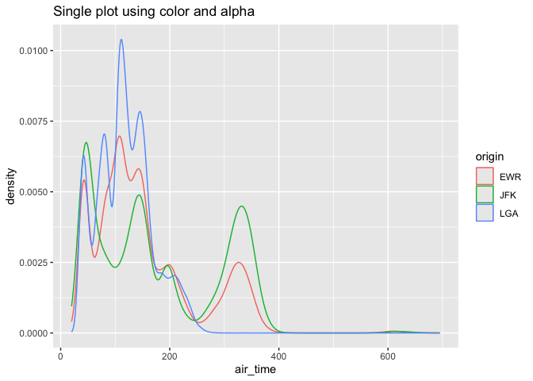<!-- -->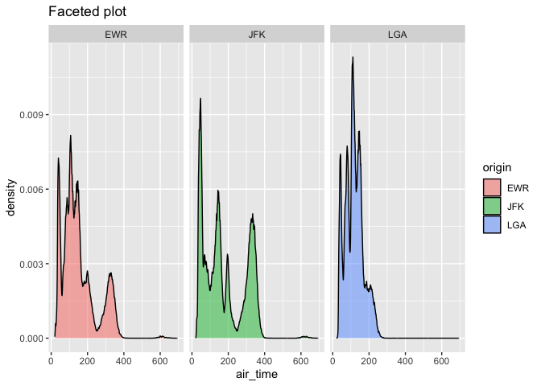<!-- -->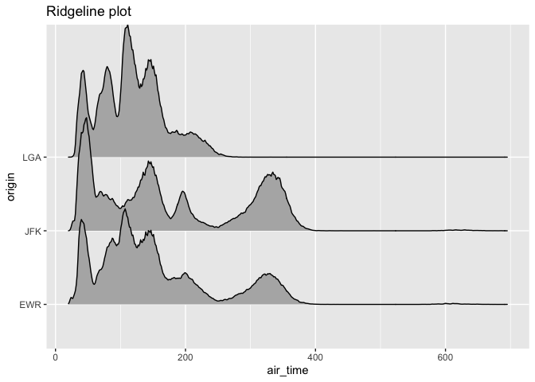<!-- -->

- **Overall**
  - The single plot and ridgeline plot help compare the distributions of
    flights from all airports.
  - The distributions of flights from EWR and JFK are fairly similar,
    with their tails extending to around 400 minutes, whereas LGA
    doesn’t extend past 200 minutes. Overall there is a mix of
    destinations from each airport.
  - The faceted plot, with one density per facet, shows a clearer
    distribution for each airport’s flights, but makes comparisons
    between airports harder.
  - For the single plot, if fill is used instead of color, the
    overlapping distributions become hard to tell apart.

## 4. Top Destinations

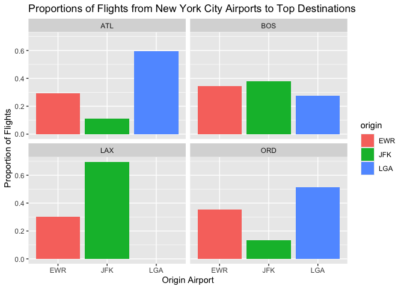<!-- -->

## 5. Summer-Only Destinations

<table class="table" style="width: auto !important; margin-left: auto; margin-right: auto;">

<thead>

<tr>

<th style="text-align:left;">

Airport code
</th>

<th style="text-align:left;">

Airport name
</th>

</tr>

</thead>

<tbody>

<tr>

<td style="text-align:left;">

ANC
</td>

<td style="text-align:left;">

Ted Stevens Anchorage Intl
</td>

</tr>

<tr>

<td style="text-align:left;">

LGA
</td>

<td style="text-align:left;">

La Guardia
</td>

</tr>

<tr>

<td style="text-align:left;">

TVC
</td>

<td style="text-align:left;">

Cherry Capital Airport
</td>

</tr>

</tbody>

</table>

## 6. High Altitude Destinations

<table class="table" style="width: auto !important; margin-left: auto; margin-right: auto;">

<thead>

<tr>

<th style="text-align:left;">

Airport code
</th>

<th style="text-align:right;">

Number of Flights
</th>

<th style="text-align:left;">

Airport name
</th>

</tr>

</thead>

<tbody>

<tr>

<td style="text-align:left;">

EGE
</td>

<td style="text-align:right;">

213
</td>

<td style="text-align:left;">

Eagle Co Rgnl
</td>

</tr>

<tr>

<td style="text-align:left;">

JAC
</td>

<td style="text-align:right;">

25
</td>

<td style="text-align:left;">

Jackson Hole Airport
</td>

</tr>

<tr>

<td style="text-align:left;">

HDN
</td>

<td style="text-align:right;">

15
</td>

<td style="text-align:left;">

Yampa Valley
</td>

</tr>

</tbody>

</table>

## 7. Cancellations and Destination Location

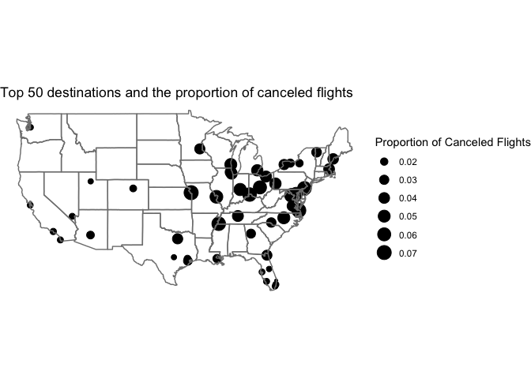<!-- -->

- Airports in the eastern part of the country show higher proportions of
  canceled flights than the western part.

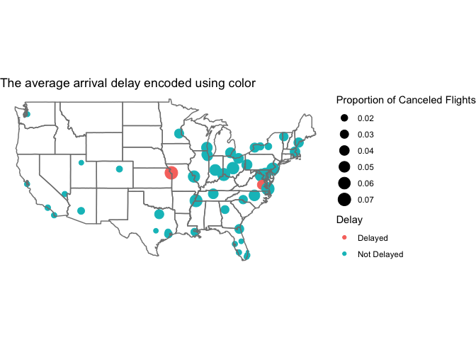<!-- -->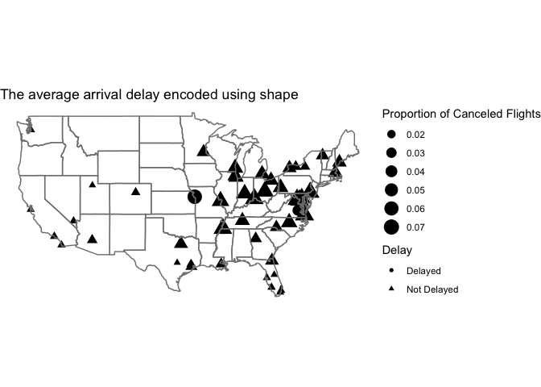<!-- -->

- There are 2 airports where the average arrival delay is more than 20
  minutes; they’re easier to spot when encoded with color.
- Comparing color and shape for encoding whether the average arrival
  delay is greater than 20 minutes:
  - With color, it’s easier to see the difference between delayed and
    least-delayed destinations, though with more than 2 levels it could
    become harder to differentiate between colors.
  - With shape, it’s easy to tell differences at a glance, but with more
    levels it can still be hard to differentiate.

## 8. Arrival vs. Departure Delay Relationship

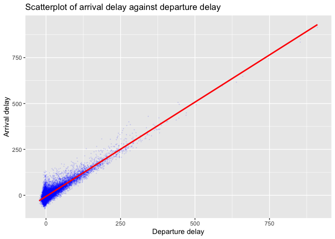<!-- -->

- The plot shows that the majority of flights have a departure delay
  between -20 and 50, and there’s a strong positive linear relationship
  between departure delay and arrival delay.

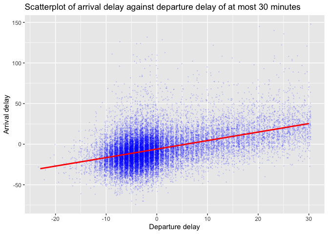<!-- -->

- Focusing on flights with a departure delay of at most 30 minutes:
  - The majority of flights have a departure delay between -10 and 0,
    whereas for arrival delay the majority falls between -50 and 25.
  - There’s a weak positive linear relationship between departure delay
    and arrival delay.

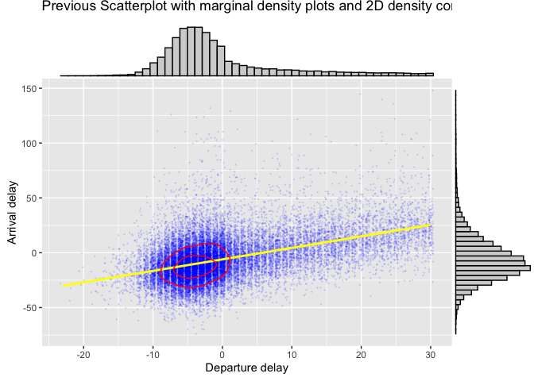<!-- -->

- Marginal plots and contours highlight the majority of the dataset,
  showing clearly that most flights have a departure delay between -10
  and 0.

## 9. Wind Speed, Time of Day, and Departure Delays

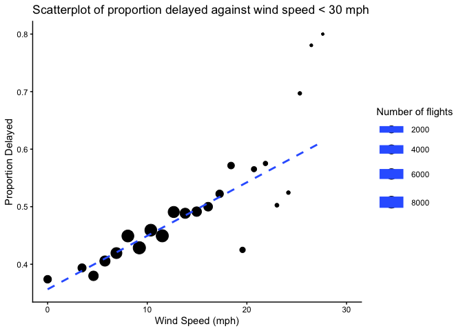<!-- -->

- There is a strong positive linear relationship between the proportion
  delayed and wind speed.
- As wind speed exceeds 20 mph, the proportion of delayed flights
  increases while the number of flights decreases.
- The highest number of flights occurs when wind speed is less than 15
  mph.

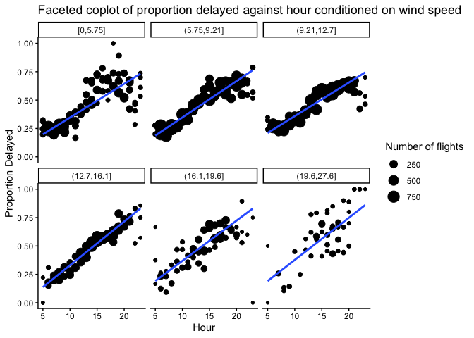<!-- -->

- There is a strong positive linear relationship between proportion
  delayed and hour when conditioned on wind speed.
- Few flights occur after 8pm, and some of those show a higher
  proportion of delays.
- There are few flights in the highest wind speed range (19.6–27.6 mph)
  at any hour.
- There is a higher number of flights when wind speed is between 5.75
  and 12.7 mph.
