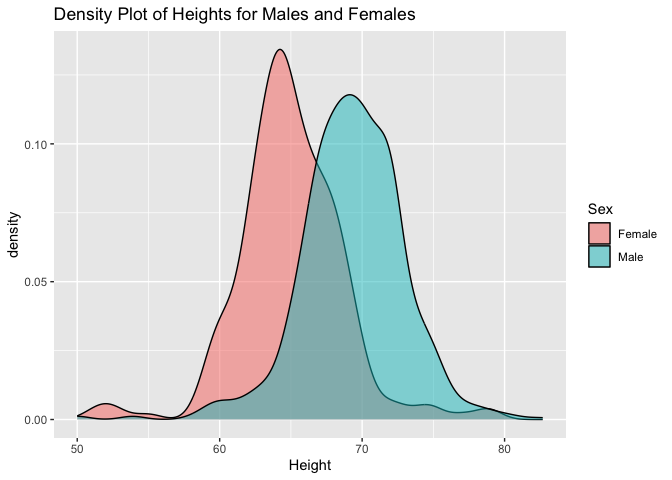
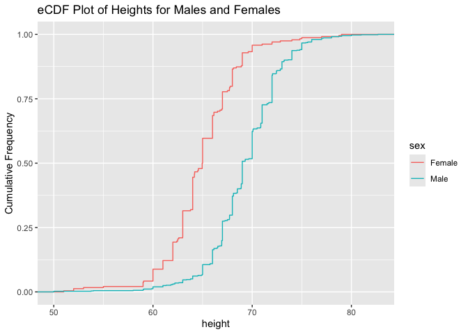
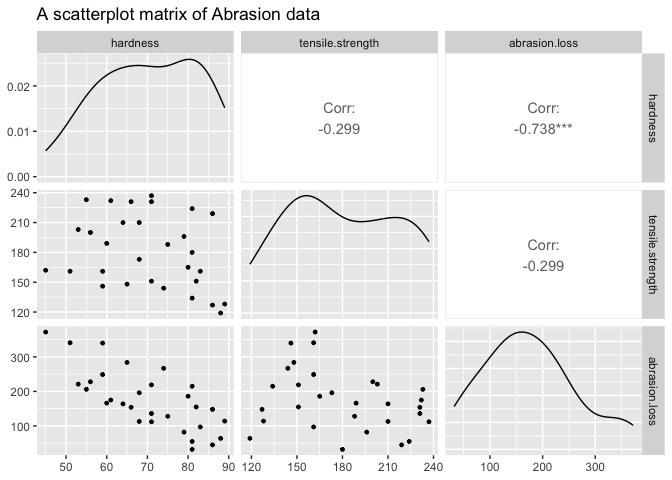
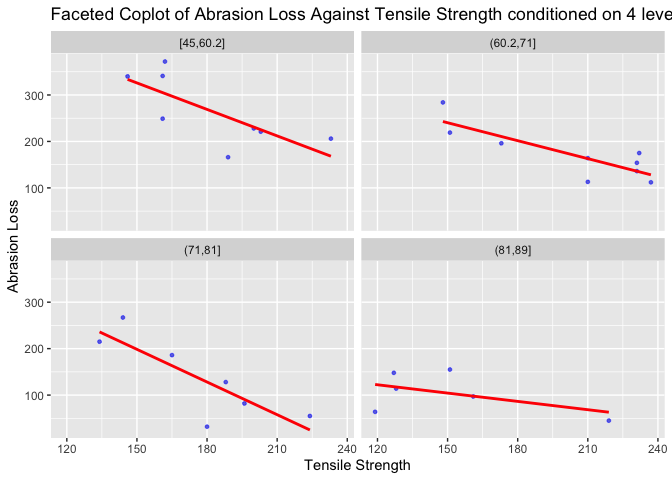

**Jocelyne Horanituze**

Sep 10, 2026

This section looks at two unrelated datasets through the lens of
distribution and diagnostic plots: self-reported height data (density
and eCDF plots, illustrating rounding/heaping bias), and rubber
abrasion-loss testing data (scatterplot matrix and faceted coplots
examining hardness, tensile strength, and abrasion loss).

## 1. Self-Reported Heights

<!-- --><!-- -->

- With the density plot:
  - We can easily see the overall distribution of both groups.
  - The small number in the female group has the highest height of
    around 64 inches, while for the male group the frequency is higher
    at the highest height compared to the female group.
- With the eCDF plot:
  - It’s easier to see the cumulative frequency for each group.
  - The highest number in the female group has a height less than 70
    inches, while in the male group a small number have a height below
    65 inches.

## 2. Abrasion Loss in Rubber Samples

<!-- -->

- There is a strong negative linear relationship between hardness and
  abrasion.loss (correlation of -0.738): as hardness increases,
  abrasion.loss decreases.
- There is a weak negative linear relationship between tensile.strength
  and abrasion.loss (correlation of -0.299).

<!-- -->

- Regardless of the level of hardness, the relationship between
  tensile.strength and abrasion.loss is negative, meaning that as
  tensile strength increases, abrasion loss decreases.
  - The relationship is strong and negative at lower levels of hardness,
    while at higher levels of hardness it is negative but weaker.
