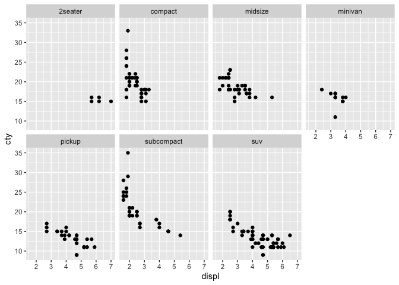
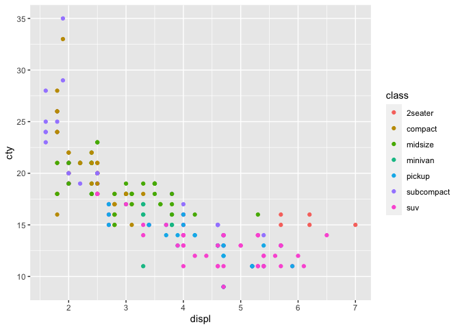
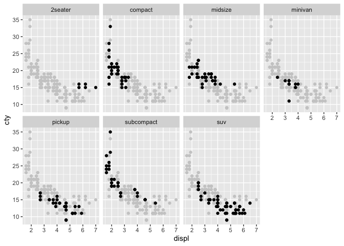
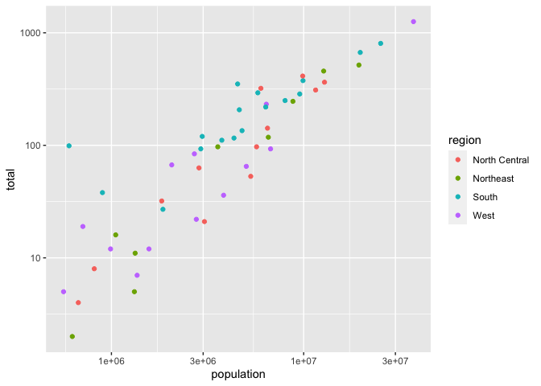

Jocelyne Horanituze/
July 03, 2023

In this file, we will be using

- *mpg* data set in R.
  - It’s the fuel economy data from 1999 to 2008 for 38 popular models
    of cars.
- *murders*
  - The data shows gun murders across the states including the District
    of Columbia

## 1. Choosing Between Faceting and Color when plotting city miles per gallon versus engine displacement across different type of cars

<!-- -->
<!-- -->

- *the advantages to using faceting instead of the color aesthetic*
  - With faceting you get to focus at one level of the variable at a
    time; while with color aesthetic levels/factors of a variable are
    overlapping and as the levels increase, it can be confusing to get
    an interpretation from the plot.
- *the disadvantages to using faceting instead of the color aesthetic*
  - comparing a variable with more than 2 levels/factors is a bit
    challenging since each level gets its own plot.
- *How might the balance change if you had a larger data set?*
  - With a larger data set and color aesthetic, it will be even more
    difficult to distinguish levels from each other, as they are more
    likely to overlap, and each level having its own color.
  - As levels of a variable increase, colors (color aesthetic) are
    barely distinct from each other which would be challenging in case
    you need to compare different levels; but with faceting you can have
    as many plots as you want.
    - The disadvantage of this is that in case you want to compare
      different levels of a variable, they need to be closer to each
      other otherwise, you can’t draw a meaningful conclusion.

## 2. Faceting with Muted Full Data (adding the full data as a background layer)

<!-- -->

- Faceting with muted full data helps to compare one level to the
  remaining levels under the same variable.
  - it’s easier to notice that subcompact has the highest cty when displ
    is the lowest.
  - 2seater has the highest displ compared to other levels.

## 3. Gun Murders in US States

<!-- -->

- The State with the highest total number of gun murders and population
  is in the West.
- The State with the lowest total number of gun murders is in Northeast.
- The States in the West have an overall low total number of gun
  murders.
