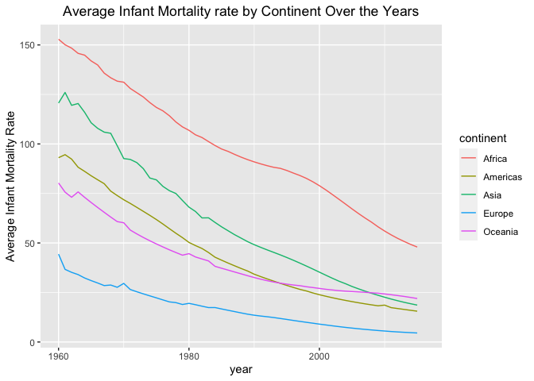
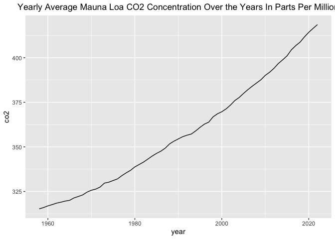

Jocelyne Horanituze/
June 15, 2023

In this file, we will be using

- the *Gapminder Data* data from dslabs package in R. - It’s a health
  and income outcomes for 184 countries from 1960 - 2016.
- The NOAA Earth System Research Laboratory [provides
  data](https://gml.noaa.gov/ccgg/trends/) on monthly mean carbon
  dioxide (CO2) measured at the Mauna Loa Observatory in Hawaii.

## 1. Average Infant Mortality Rate by Continent in 2015

<table class="table" style="width: auto !important; margin-left: auto; margin-right: auto;">
<thead>
<tr>
<th style="text-align:left;">
continent
</th>
<th style="text-align:right;">
Average_infant_mortality_rate
</th>
</tr>
</thead>
<tbody>
<tr>
<td style="text-align:left;">
Africa
</td>
<td style="text-align:right;">
47.954902
</td>
</tr>
<tr>
<td style="text-align:left;">
Oceania
</td>
<td style="text-align:right;">
21.960000
</td>
</tr>
<tr>
<td style="text-align:left;">
Asia
</td>
<td style="text-align:right;">
18.633333
</td>
</tr>
<tr>
<td style="text-align:left;">
Americas
</td>
<td style="text-align:right;">
15.554545
</td>
</tr>
<tr>
<td style="text-align:left;">
Europe
</td>
<td style="text-align:right;">
4.548718
</td>
</tr>
</tbody>
</table>

- Average infant mortality rate, in deaths per 1000, for each continent
  for the year 2015.
  - Africa shows the highest infant mortality rate of 47.9 , and Europe
    has lowest infant mortality rate of 4.5.

## 2. Average Infant Mortality Rate by Continent Over the Years

<!-- -->

- Average infant mortality rate, in deaths per 1000, for each continent
  over the years.

- The graph shows an overall decrease in infant mortality rate over the
  years across continents.

  - Europe showed the lowest infant mortality rate among all continents
    over the years, and Africa had the highest infant mortality rate.

## 3. Mauna Loa Atmospheric CO2 Concentration

<!-- -->

- The graph shows an overall increase in Atmospheric CO2 Concentration
  over the years.
- The CO2 concentration increase from 1960 - 2000, is almost the same as
  the past 20 years:
  - CO2 Concentration has increased faster over the past 20 years than
    it did, over 40 years from 1960 - 2000.
