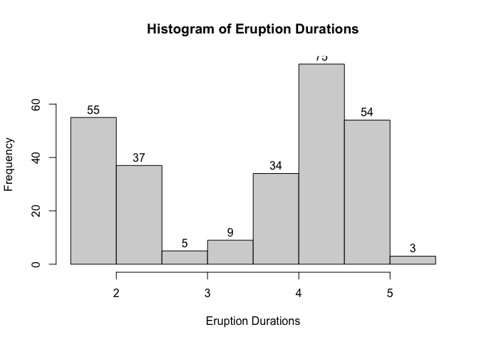

Jocelyne Horanituze
April 17, 2023

In this file, we will be using the *faithful* data set in R.

## 1. Average Waiting Time Between Eruptions

``` r
with(faithful, mean(waiting))
```

    ## [1] 70.89706

- The average waiting time between eruptions of the *Old Faithful*
  geyser in the data set `faithful` is 70.8970588 minutes.

## 2. First Four Eruption Durations

``` r
with(faithful, mean(eruptions[1:4]))
```

    ## [1] 2.754

- The average duration of the first 4 eruptions of the *Old Faithful*
  geyser in the data set `faithful` is 2.754 minutes.

## 3. First Five Records of the Eruptions Data

- The first five rows of the `faithful` data frame.

<table class="table" style="width: auto !important; margin-left: auto; margin-right: auto;">
<thead>
<tr>
<th style="text-align:right;">
eruptions
</th>
<th style="text-align:right;">
waiting
</th>
</tr>
</thead>
<tbody>
<tr>
<td style="text-align:right;">
3.600
</td>
<td style="text-align:right;">
79
</td>
</tr>
<tr>
<td style="text-align:right;">
1.800
</td>
<td style="text-align:right;">
54
</td>
</tr>
<tr>
<td style="text-align:right;">
3.333
</td>
<td style="text-align:right;">
74
</td>
</tr>
<tr>
<td style="text-align:right;">
2.283
</td>
<td style="text-align:right;">
62
</td>
</tr>
<tr>
<td style="text-align:right;">
4.533
</td>
<td style="text-align:right;">
85
</td>
</tr>
</tbody>
</table>

## 4. Histogram of Eruption Durations

``` r
with(faithful, hist(eruptions, labels= TRUE, main = "Histogram of Eruption Durations",
      xlab = "Eruption Durations"))
```

<!-- -->

- More than 100 eruptions lasted at least 4 minutes.
- Our data shows some variability; some eruption durations are short
  (less than 3 minutes) while others are long.
